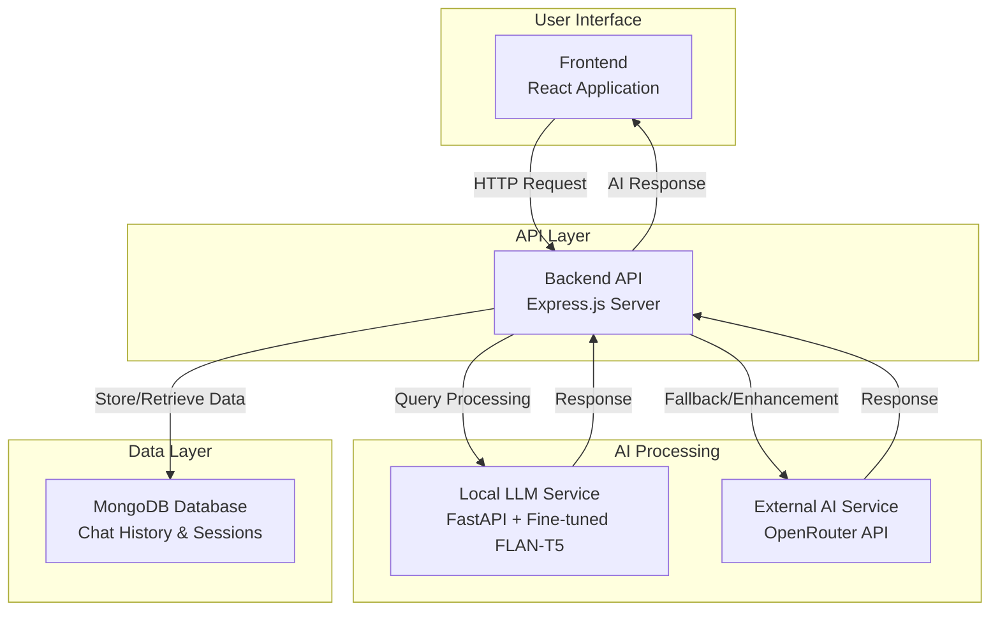

# Agri-Chatbot

## Overview

Agri-Chatbot is an intelligent conversational assistant designed to provide farmers and agricultural professionals with expert advice on crop management, disease diagnosis, treatment recommendations, and best practices. The system leverages a hybrid approach combining a locally fine-tuned large language model specialized in agriculture with external AI services to deliver accurate, context-aware responses.

## Problem Statement

Farmers often face challenges in accessing timely and reliable agricultural expertise. Limited availability of agricultural scientists, high consultation costs, and the need for immediate solutions to crop issues can lead to suboptimal decision-making and potential yield losses. Traditional information sources may not provide personalized, context-specific advice tailored to individual farming scenarios.

## Solution

Agri-Chatbot addresses these challenges by offering a web-based platform where users can engage in natural language conversations to receive:
- Detailed explanations of crop diseases and pest issues
- Evidence-based treatment recommendations
- Practical farming advice grounded in agricultural science
- Personalized responses adapted to user queries

The system integrates multiple AI models to ensure high-quality responses while maintaining data privacy through local processing capabilities.

## Technology Stack

### Frontend
- **React**: JavaScript library for building user interfaces
- **Axios**: HTTP client for API communications
- **React Markdown**: Component for rendering markdown content
- **Testing Libraries**: Jest and React Testing Library for unit and integration testing

### Backend
- **Node.js**: JavaScript runtime for server-side development
- **Express.js**: Web application framework for API development
- **MongoDB**: NoSQL database for storing chat histories and user data
- **Mongoose**: Object Data Modeling library for MongoDB
- **Axios**: HTTP client for external API integrations
- **Google Generative AI**: AI service integration (optional)
- **OpenRouter API**: External large language model service for enhanced responses

### Local LLM Service
- **Python**: Programming language for machine learning applications
- **FastAPI**: Modern web framework for building APIs with Python
- **Transformers**: Library for natural language processing and model handling
- **PEFT (Parameter-Efficient Fine-Tuning)**: Technique for fine-tuning large language models
- **PyTorch**: Deep learning framework for model execution
- **FLAN-T5**: Base model fine-tuned for agricultural domain knowledge

### Development Tools
- **Git**: Version control system
- **npm/yarn**: Package managers for JavaScript dependencies
- **pip**: Package manager for Python dependencies

## High-Level Architecture

The Agri-Chatbot system follows a microservices architecture with the following components:

### Frontend Layer
A React-based web application that provides the user interface for chat interactions. Users can input questions and view responses in a conversational format.

### Backend API Layer
An Express.js server that serves as the central orchestration point:
- Receives user queries from the frontend
- Routes requests to appropriate AI services
- Manages chat session persistence in MongoDB
- Implements authentication and rate limiting (if applicable)

### AI Processing Layer
A hybrid AI processing system comprising:
- **Local LLM Service**: A FastAPI-based service running a fine-tuned FLAN-T5 model optimized for agricultural queries
- **External AI Service**: Integration with OpenRouter API for fallback and enhanced response generation

### Data Persistence Layer
MongoDB database for storing:
- Chat histories
- User sessions
- System logs and analytics

### Communication Flow
1. User submits a query through the React frontend
2. Frontend sends the query to the Express backend
3. Backend forwards the query to the local LLM service
4. If local service is unavailable or needs enhancement, backend calls external AI service
5. Backend combines and processes responses
6. Response is sent back to frontend for display
7. Chat history is persisted in MongoDB



## Installation

### Prerequisites
- Node.js (version 16 or higher)
- Python (version 3.8 or higher)
- MongoDB (local installation or cloud instance)
- Git

### Backend Setup
1. Navigate to the backend directory:
   ```
   cd Nell.Ai/backend
   ```
2. Install dependencies:
   ```
   npm install
   ```
3. Create a `.env` file with required environment variables:
   ```
   OPENROUTER_API_KEY=your_openrouter_api_key
   MONGODB_URI=your_mongodb_connection_string
   ```
4. Start the backend server:
   ```
   node server.js
   ```

### Frontend Setup
1. Navigate to the frontend directory:
   ```
   cd Nell.Ai/frontend
   ```
2. Install dependencies:
   ```
   npm install
   ```
3. Start the development server:
   ```
   npm start
   ```

### Local LLM Service Setup
1. Navigate to the LLM API directory:
   ```
   cd Nell.Ai/agri-llm-api
   ```
2. Install Python dependencies:
   ```
   pip install fastapi uvicorn transformers peft torch
   ```
3. Ensure the fine-tuned model is present in the `model/` directory
4. Start the LLM service:
   ```
   uvicorn main:app --host 127.0.0.1 --port 8000
   ```

### Database Setup
1. Ensure MongoDB is running locally or configure a cloud instance
2. The application will automatically create required collections on first use

## Usage

1. Start all services in the following order:
   - MongoDB
   - Local LLM service
   - Backend API
   - Frontend application

2. Access the application through the frontend URL (typically http://localhost:3000)

3. Enter agricultural queries in the chat interface

4. Receive AI-generated responses with expert advice

## Contributing

1. Fork the repository
2. Create a feature branch
3. Make changes and test thoroughly
4. Submit a pull request with detailed description

## License

This project is licensed under the ISC License.